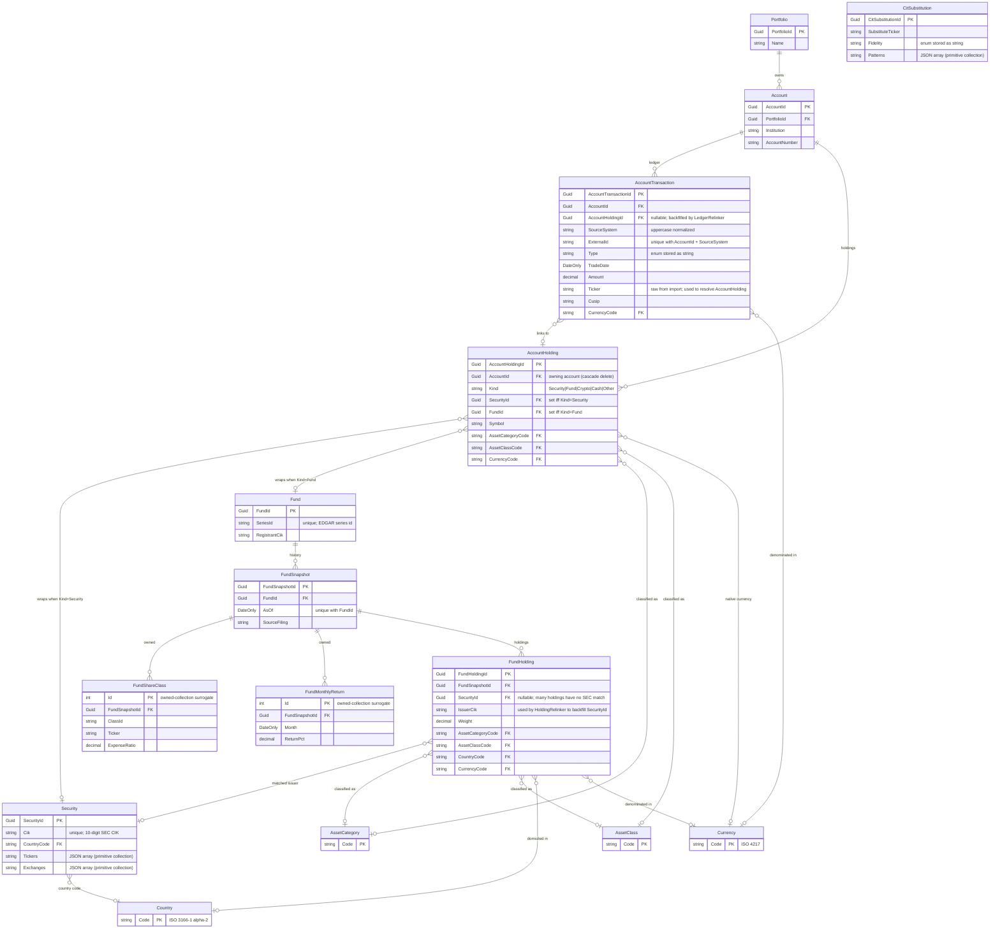

# ER Diagram

This is the persistence-layer view of the Vizfolio domain — what's in the database, how the tables relate, and which fields carry identity. Read it when you need a quick map before touching schema, migrations, or queries. Source of truth is `src/Vizfolio.Domain/` for the classes and `src/Vizfolio.Infrastructure/Persistence/Configurations/` for the EF mappings.

## Diagram

## Aggregates and what each cluster is for

**Portfolio → Account → AccountTransaction** is the user's ledger. A `Portfolio` is a logical grouping; an `Account` is one brokerage/institution account inside it; an `AccountTransaction` is one row in that account's history. Transactions are uniquely identified within an account by `(AccountId, SourceSystem, ExternalId)` so re-imports are idempotent.

**AccountHolding** is what an account holds — one row per tradeable asset *within an account*. The `Kind` discriminator selects between `Security`, `Fund`, `Crypto`, `Cash`, and `Other`; for `Security`/`Fund` the corresponding nullable FK is populated. Crypto/Cash/Other carry their symbol + classification on `AccountHolding` itself without a sibling reference entity. Holdings are created lazily — either during import (`PortfolioImportService`) or after the fact (`LedgerRelinker`) — by `Vizfolio.Application.Portfolios.AccountHoldingResolver`, which resolves a ticker to a `Security` or to the latest `FundSnapshot`'s `ShareClass.Ticker`. The resolver is primed per-account, so the same security imported into two different accounts produces two distinct `AccountHolding` rows.

There is intentionally **no DB-level uniqueness** on `(AccountId, SecurityId)` or `(AccountId, FundId)`. Real-world brokerage exports sometimes blend two sub-accounts (e.g. taxable + IRA) under one imported account and report the same fund twice; we want room to model that case without a schema fight. The resolver still dedupes within a single priming pass, so a normal import does not create duplicates.

**Security** is reference data from SEC EDGAR keyed on `Cik`. Multiple tickers per issuer are stored as a JSON primitive collection (`Tickers`). The relinkers match transactions/holdings to securities by ticker or CIK.

**Fund → FundSnapshot** is point-in-time reference data, also from EDGAR. `FundSnapshot.ShareClasses` and `MonthlyReturns` are EF Core *owned collections* — they have surrogate `int Id` PKs and only exist in the context of their parent snapshot (CASCADE delete). `FundHolding` is a normal entity (not owned) because it can be linked to a `Security`.

**FundHolding.SecurityId** is nullable on purpose: many fund holdings don't correspond to any SEC-filed security (foreign equities, derivatives, cash positions). `IssuerCik` is captured for post-import relinking by `HoldingRelinker`. This is the same dual-identity pattern as `AccountTransaction` had before the AccountHolding refactor.

**Reference tables** (`AssetCategory`, `AssetClass`, `Country`, `Currency`) are seeded via EF Core `HasData` (see `*Seed.cs` and the `Init` migration's `InsertData` calls). All FKs to them use `DeleteBehavior.Restrict`.

**CitSubstitution** is standalone — it maps user-entered Collective Investment Trust names to substitute tickers via the `Patterns` JSON array. It doesn't FK anywhere; lookups are by name pattern matching.

## Quick references

| Topic                                            | Source                                                                  |
| ------------------------------------------------ | ----------------------------------------------------------------------- |
| Domain classes                                   | `src/Vizfolio.Domain/{Portfolios,Securities,Funds,Reference}/`             |
| EF mappings, table/column names, indexes         | `src/Vizfolio.Infrastructure/Persistence/Configurations/`                  |
| Reference-data seeds                             | `src/Vizfolio.Infrastructure/Persistence/Seeding/`                         |
| Current schema as SQL                            | `src/Vizfolio.Infrastructure/Persistence/Migrations/*_Init.cs`             |
| Resolving a transaction's holding                | `src/Vizfolio.Application/Portfolios/AccountHoldingResolver.cs`            |
| Backfilling existing transactions to Holdings    | `src/Vizfolio.Application/PortfolioImports/Services/LedgerRelinker.cs`     |
| Backfilling fund holdings to Securities          | `src/Vizfolio.Application/Extracts/Importers/HoldingRelinker.cs`           |
