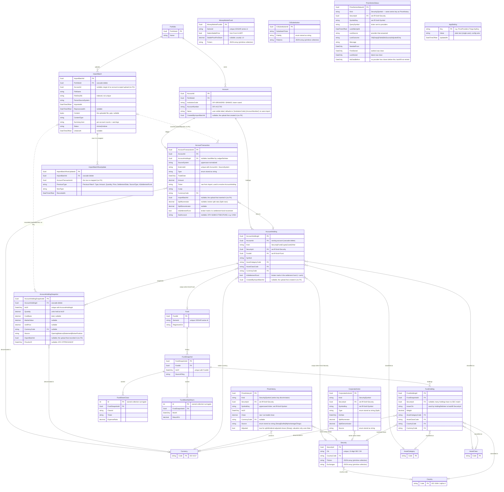

# ER Diagram

This is the persistence-layer view of the Vizfolio domain — what's in the database, how the tables relate, and which fields carry identity. Read it when you need a quick map before touching schema, migrations, or queries. Source of truth is `backend/src/Vizfolio.Domain/` for the classes and `backend/src/Vizfolio.Infrastructure/Persistence/Configurations/` for the EF mappings.

## Diagram

```mermaid
erDiagram
    %% Portfolio aggregate
    Portfolio    ||--o{ Account              : "owns"
    Account      ||--o{ AccountTransaction   : "ledger"
    Account      ||--o{ AccountHolding       : "holdings"
    Portfolio    ||--o{ ImportBatch          : "uploads"
    ImportBatch  ||--o{ ImportBatchRowUpdate : "rows it re-mapped"
    ImportBatch  |o..o{ AccountTransaction   : "inserted (ImportBatchId, no FK)"
    ImportBatch  |o..o{ AccountHoldingSnapshot : "recorded (ImportBatchId, no FK)"

    %% Transaction → AccountHolding is how transactions point at *anything* tradeable
    AccountTransaction }o--o| AccountHolding : "links to"
    AccountTransaction }o--o| Currency       : "denominated in"

    %% AccountHoldingSnapshot anchors point-in-time positions (broker statements, opening balances)
    AccountHolding ||--o{ AccountHoldingSnapshot : "snapshots"
    AccountHoldingSnapshot }o--o| Currency       : "denominated in"

    %% AccountHolding is the per-account asset reference (Security / Fund / Crypto / Cash / Other)
    AccountHolding }o--o| Security           : "wraps when Kind=Security"
    AccountHolding }o--o| Fund               : "wraps when Kind=Fund"
    AccountHolding }o--o| AssetCategory      : "classified as"
    AccountHolding }o--o| AssetClass         : "classified as"
    AccountHolding }o--o| Currency           : "native currency"

    %% Security reference data
    Security     }o--o| Country              : "country code"

    %% Price history & corporate actions — shared reference series keyed by Security or bare symbol
    PriceHistory    }o--o| Security          : "series when linked"
    PriceHistory    }o--o| Currency          : "priced in"
    CorporateAction }o--o| Security          : "series when linked"

    %% Fund aggregate — snapshots own share classes and monthly returns
    Fund         ||--o{ FundSnapshot         : "history"
    FundSnapshot ||--o{ FundShareClass       : "owned"
    FundSnapshot ||--o{ FundMonthlyReturn    : "owned"
    FundSnapshot ||--o{ FundHolding          : "holdings"

    %% FundHolding tracks underlyings; linkage to a Security is best-effort
    FundHolding  }o--o| Security             : "matched issuer"
    FundHolding  }o--o| AssetCategory        : "classified as"
    FundHolding  }o--o| AssetClass           : "classified as"
    FundHolding  }o--o| Country              : "domiciled in"
    FundHolding  }o--o| Currency             : "denominated in"

    %% Entity columns (PKs, FKs, identity-bearing fields only — see source for the rest)
    Portfolio {
        Guid     PortfolioId        PK
        string   Name
    }

    Account {
        Guid     AccountId          PK
        Guid     PortfolioId        FK
        string   InstitutionCode        "OFX BROKERID / BANKID; lower-cased"
        string   AccountNumber          "OFX ACCTID"
        string   Name                   "user-visible label; defaults to '{InstitutionCode} {AccountNumber}' on auto-import"
        Guid     CreatedByImportBatchId     "nullable; the upload that created it (no FK)"
    }

    ImportBatch {
        Guid     ImportBatchId      PK
        Guid     PortfolioId        FK "cascade delete"
        Guid     AccountId              "nullable; target of an account-scoped upload (no FK)"
        string   FileName
        string   FileSha256             "indexed, not unique"
        string   ParserSourceSystem
        DateTimeOffset ImportedAt
        DateTimeOffset ReprocessedAt    "nullable"
        bytes    Content                "the uploaded file, gzip; nullable"
        string   ContentType
        string   SummaryJson            "per-account counts + warnings"
        string   Status                 "Active|Undone"
        DateTimeOffset UndoneAt         "nullable"
    }

    ImportBatchRowUpdate {
        Guid     ImportBatchRowUpdateId PK
        Guid     ImportBatchId      FK "cascade delete"
        Guid     AccountTransactionId   "the row re-mapped (no FK)"
        string   PreviousType           "Previous*/Next*: Type, Amount, Quantity, Price, SettlementDate, SourceType, IsSettlementFund"
        string   NextType
        DateTimeOffset RecordedAt
    }

    AccountTransaction {
        Guid     AccountTransactionId PK
        Guid     AccountId           FK
        Guid     AccountHoldingId    FK "nullable; backfilled by LedgerRelinker"
        string   SourceSystem            "uppercase normalized"
        string   ExternalId              "unique with AccountId + SourceSystem"
        string   Type                    "enum stored as string"
        DateOnly TradeDate
        decimal  Amount
        string   Ticker                  "raw from import; used to resolve AccountHolding"
        string   Cusip
        string   CurrencyCode        FK
        Guid     ImportBatchId           "nullable; the upload that inserted it (no FK)"
        decimal  SplitNumerator          "nullable; broker split ratio (Split rows)"
        decimal  SplitDenominator        "nullable"
        bool     IsSettlementFund        "broker marks it a settlement-fund movement"
        string   SubAccount              "nullable; OFX SUBACCTSEC/FUND, e.g. CASH"
    }

    AccountHolding {
        Guid     AccountHoldingId    PK
        Guid     AccountId           FK "owning account (cascade delete)"
        string   Kind                    "Security|Fund|Crypto|Cash|Other"
        Guid     SecurityId          FK "set iff Kind=Security"
        Guid     FundId              FK "set iff Kind=Fund"
        string   Symbol
        string   AssetCategoryCode   FK
        string   AssetClassCode      FK
        string   CurrencyCode        FK
        bool     IsSettlementFund        "broker marks it the settlement fund (= cash)"
        Guid     CreatedByImportBatchId  "nullable; the upload that created it (no FK)"
    }

    AccountHoldingSnapshot {
        Guid     AccountHoldingSnapshotId PK
        Guid     AccountHoldingId         FK "cascade delete"
        DateOnly AsOf                         "unique with AccountHoldingId"
        decimal  Quantity                     "units held at AsOf"
        decimal  CostBasis                    "total, nullable"
        decimal  MarketValue                  "nullable"
        decimal  UnitPrice                    "nullable"
        string   CurrencyCode             FK "nullable"
        string   Source                       "OpeningBalance|Statement|BrokerPosition"
        Guid     ImportBatchId                "nullable; the upload that recorded it (no FK)"
        DateOnly PriceAsOf                    "nullable; OFX DTPRICEASOF"
    }

    Security {
        Guid     SecurityId          PK
        string   Cik                     "unique; 10-digit SEC CIK"
        string   CountryCode         FK
        string   Tickers                 "JSON array (primitive collection)"
        string   Exchanges               "JSON array (primitive collection)"
    }

    Fund {
        Guid     FundId              PK
        string   SeriesId                "unique; EDGAR series id"
        string   RegistrantCik
    }

    FundSnapshot {
        Guid     FundSnapshotId      PK
        Guid     FundId              FK
        DateOnly AsOf                    "unique with FundId"
        string   SourceFiling
    }

    FundShareClass {
        int      Id                  PK "owned-collection surrogate"
        Guid     FundSnapshotId      FK
        string   ClassId
        string   Ticker
        decimal  ExpenseRatio
    }

    FundMonthlyReturn {
        int      Id                  PK "owned-collection surrogate"
        Guid     FundSnapshotId      FK
        DateOnly Month
        decimal  ReturnPct
    }

    FundHolding {
        Guid     FundHoldingId       PK
        Guid     FundSnapshotId      FK
        Guid     SecurityId          FK "nullable; many holdings have no SEC match"
        string   IssuerCik               "used by HoldingRelinker to backfill SecurityId"
        decimal  Weight
        string   AssetCategoryCode   FK
        string   AssetClassCode      FK
        string   CountryCode         FK
        string   CurrencyCode        FK
    }

    MoneyMarketFund {
        Guid     MoneyMarketFundId   PK
        string   SeriesId                "unique; EDGAR series id"
        bool     SeeksStablePrice        "from Form N-MFP"
        decimal  StablePricePerShare     "nullable; usually 1.0"
        string   Tickers                 "JSON array (primitive collection)"
    }

    CitSubstitution {
        Guid     CitSubstitutionId   PK
        string   SubstituteTicker
        string   Fidelity                "enum stored as string"
        string   Patterns                "JSON array (primitive collection)"
    }

    PriceHistory {
        Guid     PriceHistoryId      PK
        string   Kind                    "Security|Symbol (series key discriminator)"
        Guid     SecurityId          FK "set iff Kind=Security"
        string   SymbolKey               "uppercased ticker; set iff Kind=Symbol"
        DateOnly AsOf
        decimal  Close                   "raw / as-traded close"
        string   CurrencyCode        FK "nullable"
        string   Source                  "enum stored as string (Stooq|Eodhd|AlphaVantage|Tiingo)"
        bool     Adjusted                "true for split/dividend-adjusted closes (Stooq); valuation only uses false"
    }

    PriceSeriesStatus {
        Guid     PriceSeriesStatusId PK
        string   Kind                    "Security|Symbol — same series key as PriceHistory"
        Guid     SecurityId          FK "set iff Kind=Security"
        string   SymbolKey               "set iff Kind=Symbol"
        string   QuerySymbol             "ticker sent to providers"
        DateTimeOffset LastAttemptAt
        string   LastSource              "provider that answered"
        string   LastOutcome             "Ok|Empty|Failed|NoSource|AdjustedOnly"
        string   Message
        DateOnly NeededFrom
        DateOnly FirstStored             "earliest raw close"
        DateOnly LastStored              "latest raw close"
        DateOnly NoDataBefore            "no provider has closes before this; backfill not retried"
    }

    AppSetting {
        string   Key                 PK "e.g. PriceProviders:Tiingo:ApiKey"
        string   Value                  "plain text (single-user); config wins"
        DateTimeOffset UpdatedAt
    }

    CorporateAction {
        Guid     CorporateActionId   PK
        string   Kind                    "Security|Symbol"
        Guid     SecurityId          FK "set iff Kind=Security"
        string   SymbolKey               "set iff Kind=Symbol"
        string   Type                    "enum stored as string (Split)"
        DateOnly ExDate
        decimal  SplitNumerator
        decimal  SplitDenominator
        string   Source                  "enum stored as string"
    }

    %% Reference tables (string-PK code lookups)
    AssetCategory { string Code PK }
    AssetClass    { string Code PK }
    Country       { string Code PK "ISO 3166-1 alpha-2" }
    Currency      { string Code PK "ISO 4217" }
```

## Aggregates and what each cluster is for

**Portfolio → Account → AccountTransaction** is the user's ledger. A `Portfolio` is a logical grouping; an `Account` is one brokerage/institution account inside it; an `AccountTransaction` is one row in that account's history. Transactions are uniquely identified within an account by `(AccountId, SourceSystem, ExternalId)` so re-imports are idempotent. Accounts are uniquely identified within a portfolio by `(PortfolioId, InstitutionCode, AccountNumber)` — `InstitutionCode` is the OFX `BROKERID` / `BANKID` (e.g. `vanguard.com`), normalized to lower case, and `AccountNumber` is the OFX `ACCTID`. The portfolio-scoped import endpoint (`POST /api/portfolios/{id}/imports`) uses this pair to find-or-create an account per `<INVSTMTRS>` block in a multi-account QFX file.

**ImportBatch** records each uploaded file (name, SHA-256, parser, time, the file itself gzip-compressed, a JSON summary of counts and warnings, and `Active`/`Undone`). It's what makes imports reversible and re-parseable: rows and snapshots it inserted carry `ImportBatchId`, accounts and holdings it created carry `CreatedByImportBatchId`, and `ImportBatchRowUpdate` keeps the before/after values of stored rows it re-mapped (the import-owned fields `Type`, `Amount`, `Quantity`, `Price`, `SettlementDate`, `SourceType`, `IsSettlementFund`). These provenance ids are **indexed columns without FKs**: the rows already cascade from the portfolio through their account, and SQL Server rejects a second cascade/set-null path; batches are never deleted (undo marks them). `ImportBatch.AccountId` is set for account-tab uploads and for portfolio uploads of a file without account numbers that went to one account (routed by its transactions), so reprocessing returns it there. Re-uploading a file whose hash matches an active batch writes nothing; undone batches are ignored by that check, so a file can be imported again. Synthetic ids of id-less formats are `"{fingerprint}-{occurrence}"`, stable across exports, so future user corrections can key on `(AccountId, SourceSystem, ExternalId)`. See [performance-api.md → Import batches](./performance-api.md#import-batches-provenance-re-uploads-reprocess-and-undo).

`TransactionType` also includes `ReturnOfCapital` (cash in, not income or a contribution) and `Journal` (between an account's own sub-accounts; neutral). A `Split` row may carry the broker's ratio (`SplitNumerator`/`SplitDenominator`), applied when no provider `CorporateAction` covers it. Account numbers are matched normalized (letters and digits, upper-cased — `Account.NormalizeAccountNumber`).

**AccountHolding** is what an account holds — one row per tradeable asset *within an account*. The `Kind` discriminator selects between `Security`, `Fund`, `Crypto`, `Cash`, and `Other`; for `Security`/`Fund` the corresponding nullable FK is populated. Crypto/Cash/Other carry their symbol + classification on `AccountHolding` itself without a sibling reference entity. An account has at most one `Kind = Cash` holding (symbol `$CASH`), created when cash is entered as an opening balance or a QFX statement reports available cash (`<INVBAL><AVAILCASH>`) that isn't the settlement fund's position; its snapshots — together with the settlement fund's — anchor the account's cash, which the valuation engine values from the ledger rather than as a security. Holdings are created lazily — either during import (`PortfolioImportService`) or after the fact (`LedgerRelinker`) — by `Vizfolio.Application.Portfolios.AccountHoldingResolver`, which resolves a ticker to a `Security` or to the latest `FundSnapshot`'s `ShareClass.Ticker`. **Every row naming a security gets a holding:** a ticker reference data doesn't recognise (or a CUSIP with no ticker) gets an unclassified `Kind = Other` holding, so its shares are always valued; `LedgerRelinker` (run after every import and reference-data refresh) promotes it in place to `Security`/`Fund` once recognised (`AccountHolding.PromoteToSecurity`/`PromoteToFund` keep the id, so rows and snapshots stay attached). The resolver is primed per-account, so the same security imported into two different accounts produces two distinct `AccountHolding` rows.

There is intentionally **no DB-level uniqueness** on `(AccountId, SecurityId)` or `(AccountId, FundId)`. Real-world brokerage exports sometimes blend two sub-accounts (e.g. taxable + IRA) under one imported account and report the same fund twice; we want room to model that case without a schema fight. The resolver dedupes within a single priming pass by `(EntityId, Symbol)` — not by `EntityId` alone — so different share classes of the same fund (e.g. an ETF and a mutual fund share class of one index fund, both pointing at the same Vanguard `Fund`) produce distinct `AccountHolding` rows. The same applies to multi-ticker `Security` issuers (e.g. BRK.A / BRK.B).

**AccountHoldingSnapshot** is a point-in-time position record — "as of date X, this holding had Y units (and optionally cost basis / market value / unit price)." It exists so rollups can handle the partial-history case (broker statement only goes back 2 years, but the user knows their starting position) and so periodic broker statements can act as reconciliation checkpoints. The rollup pattern is: take the latest snapshot ≤ asOf, then replay transactions strictly after that snapshot's `AsOf`. Three `Source` values reflect provenance: `OpeningBalance` (user-supplied starting state for partial history), `Statement` (user-uploaded broker statement reconciliation), and `BrokerPosition` (automatically captured from OFX `<INVPOSLIST>` at the statement's `DTASOF` on every import). The unique index on `(AccountHoldingId, AsOf)` enforces dedupe across re-imports; `PortfolioImportService` also pre-checks before inserting. When the transaction log is complete and `BrokerPosition` snapshots also land on each import, the two are expected to agree — divergence is evidence of a missing transaction or unhandled corporate action.

**Security** is reference data from SEC EDGAR keyed on `Cik`. Multiple tickers per issuer are stored as a JSON primitive collection (`Tickers`). The relinkers match transactions/holdings to securities by ticker or CIK.

**Fund → FundSnapshot** is point-in-time reference data, also from EDGAR. `FundSnapshot.ShareClasses` and `MonthlyReturns` are EF Core *owned collections* — they have surrogate `int Id` PKs and only exist in the context of their parent snapshot (CASCADE delete). `FundHolding` is a normal entity (not owned) because it can be linked to a `Security`.

**FundHolding.SecurityId** is nullable on purpose: many fund holdings don't correspond to any SEC-filed security (foreign equities, derivatives, cash positions). `IssuerCik` is captured for post-import relinking by `HoldingRelinker`. This is the same dual-identity pattern as `AccountTransaction` had before the AccountHolding refactor.

**Reference tables** (`AssetCategory`, `AssetClass`, `Country`, `Currency`) are seeded via EF Core `HasData` (see `*Seed.cs` and the `Init` migration's `InsertData` calls). All FKs to them use `DeleteBehavior.Restrict`.

**MoneyMarketFund** is standalone reference data — one row per money market fund series from fund-extracts' `money_market_funds.json` (built from SEC Form N-MFP). Valuation matches a holding's symbol against its `Tickers` to know whether it's a money market fund and, if it seeks a stable price, at what price to value it. It doesn't FK anywhere.

**CitSubstitution** is standalone — it maps user-entered Collective Investment Trust names to substitute tickers via the `Patterns` JSON array. It doesn't FK anywhere; lookups are by name pattern matching.

**PriceHistory → CorporateAction** are shared reference price series (not per-account). A series is keyed by either a linked `Security` (`Kind=Security`, `SecurityId` set) or a bare uppercased ticker (`Kind=Symbol`, `SymbolKey` set) for holdings with no SEC match — a guarded constructor enforces exactly one. `PriceHistory` holds one **raw / as-traded** daily `Close` per series per date (the same basis as ledger quantities), and the performance service values a holding as `quantity(from ledger roll-forward) × Close` with a broker-snapshot fallback — see [price-history-valuation.md](./price-history-valuation.md). `CorporateAction` records sparse split events separately (dense prices vs. sparse actions), and is the authoritative source of split factors the quantity roll-forward applies to `TransactionType.Split` rows. Neither table uses a filtered unique index (not provider-portable); one row per series per date is enforced in `PriceHistoryImporter`'s in-memory upsert. Prices are fetched per-user-instance into the local DB by pluggable `IPriceHistorySource`s tried in priority order (Tiingo recommended, Alpha Vantage, EODHD; Stooq is off by default and its rows are stored `Adjusted = true`, which valuation ignores). **PriceSeriesStatus** keeps, per series, how its last fetch went and which raw closes are stored (one row per series, enforced by the importer), feeding `GET /api/prices/status`. **AppSetting** is a key/value table for settings changed from the UI — today, price provider API keys saved in Settings (configuration always wins).

## Quick references

| Topic                                            | Source                                                                  |
| ------------------------------------------------ | ----------------------------------------------------------------------- |
| Domain classes                                   | `backend/src/Vizfolio.Domain/{Portfolios,Securities,Funds,Reference,Pricing}/`     |
| Price fetch pipeline (sources, importer)         | `backend/src/Vizfolio.Application/Pricing/`, `backend/src/Vizfolio.Infrastructure/Pricing/` |
| EF mappings, table/column names, indexes         | `backend/src/Vizfolio.Infrastructure/Persistence/Configurations/`                  |
| Reference-data seeds                             | `backend/src/Vizfolio.Infrastructure/Persistence/Seeding/`                         |
| Current schema as SQL                            | `backend/src/Vizfolio.Infrastructure/Persistence/Migrations/*_Init.cs`             |
| Resolving a transaction's holding                | `backend/src/Vizfolio.Application/Portfolios/AccountHoldingResolver.cs`            |
| Backfilling existing transactions to Holdings    | `backend/src/Vizfolio.Application/PortfolioImports/Services/LedgerRelinker.cs`     |
| Backfilling fund holdings to Securities          | `backend/src/Vizfolio.Application/Extracts/Importers/HoldingRelinker.cs`           |
